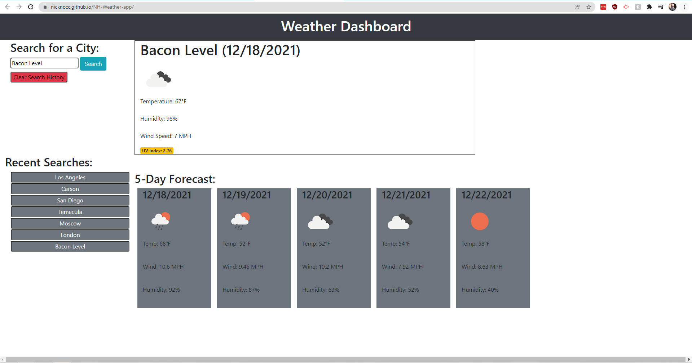

# Weather app

## Description
  
Tired of looking at online weather apps and getting overwhelmed by all of the superfluous information? Well worry no longer, my brand new weather app allows you to look up the weather for any city you wish and it returns only the most relevant information for your weather needs. Not only that but the site will remember what cities you have revently searched and create shortcuts so you can get your weather information fast and get on with the rest of your day.

## Questions

  
  
GitHub: https://github.com/NickNocc  
Email: haretakis4@gmail.com

## Live Server: https://nicknocc.github.io/NH-Weather-app/

